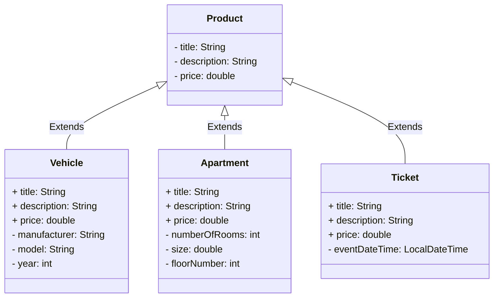

# Perintä ja rajapinnat

Tämä repositorio sisältää joukon Java-harjoituksia, joiden avulla perehdyt perintään ja rajapintoihin.

Tehtävän yhteyteen suosittelemme seuraavia itseopiskelumateriaaleja:

* [Objects, Classes, Interfaces, Packages, and Inheritance (dev.java)](https://dev.java/learn/oop/)
* [Java Polymorphism Fully Explained In 7 Minutes (Coding with John, YouTube)](https://youtu.be/jhDUxynEQRI)
* [Super Keyword in Java Full Tutorial - How to Use "super" (Coding with John, YouTube)](https://www.youtube.com/watch?v=Qb_NUn0TSAU)

Lisäksi sinun tulee etsiä itsenäisesti tietoa erinäisistä lähteistä.


## Tehtävän aloittaminen

Aloita kloonaamalla Git-repositorio omalle koneellesi. Harjoitus täytyy tehdä omassa kopiossasi, eli varmista, että repositorion osoitteessa on mukana oma GitHub-käyttäjätunnuksesi! Oman kopiosi saat luotua kurssitoteutuksesi tehtävänannon GitHub classroom -linkin kautta.

```sh
git clone https://github.com/varmista-etta-github-tunnuksesi-on-repositorion-osoitteessa.git
```

Kloonattuasi projektin omalle koneellesi, avaa se koodieditorissasi.


## Vastausten lähettäminen

Kun olet saanut osan tai kaikki tehtävistä ratkaistua ja commitoinut vastauksesi, lähetä ratkaisut arvioitavaksi `git push`-komennolla. Git push käynnistää automaattisesti GitHub actions -workflow:n, joka kääntää sekä testaa ratkaisusi ja antaa jokaisesta testistä joko hyväksytyn tai hylätyn tuloksen.

Kun GitHub Actions on saanut koodisi suoritettua, näet tuloksen GitHub-repositoriosi [Actions-välilehdellä](../../actions/workflows/classroom.yml). Arvioinnin valmistumiseen menee tyypillisesti pari minuuttia.

Klikkaamalla yllä olevan linkin takaa viimeisintä *"GitHub Classroom Workflow"* -suoritusta, saat tarkemmat tiedot tehtävän arvioinnista. Sivun alaosassa näkyy saamasi pisteet. Klikkaamalla "Autograding"-otsikkoa pääset katsomaan tarkemmin arvioinnissa suoritetut vaiheet ja niiden tulokset. Kuvitetun ohjeen aiheesta löydät GitHubin dokumentista [View autograding results (github.com)](https://docs.github.com/en/education/manage-coursework-with-github-classroom/learn-with-github-classroom/view-autograding-results).

💡 *Voit lähettää ratkaisusi arvioitavaksi niin monta kertaa kuin on tarpeen tehtävän määräaikaan asti. Varmista kuitenkin, että viimeisin suoritus tuottaa parhaat pisteet, koska vain viimeisimmät pisteet jäävät voimaan.*


### Osa 1: perintä *(perusteet, 10 % + 10 %)*

Tämän tehtäväpohjan [inheritance.webshop](./src/main/java/inheritance/webshop/)-paketissa on neljä Java-luokkaa, joiden tarkoitus on mallintaa kuvitteellisessa web-pohjaisessa osto- ja myyntipalvelussa olevia tuotteita. Oletuksena kaikki tuotteet sisältävät tyypistä riippumatta [`Product`](./src/main/java/inheritance/webshop/Product.java)-luokassa määritellyt tiedot (title, description, price). [Ajoneuvoille](./src/main/java/inheritance/webshop/Vehicle.java), [asunnoille](./src/main/java/inheritance/webshop/Apartment.java) ja [pääsylipuille](./src/main/java/inheritance/webshop/Ticket.java) on omat luokkansa, jotka sisältävät juuri näille tuotteille ominaisia lisätietoja:



Tässä tehtävässä sinun tulee ensin toteuttaa [`Product`](./src/main/java/inheritance/webshop/Product.java)-luokka siinä olevien kommenttien mukaisesti. Kun olet saanut `Product`-luokan toteutettua ja se läpäisee luokalle kirjoitetut testit, toteuta [`Vehicle`](./src/main/java/inheritance/webshop/Vehicle.java)-luokka siihen kirjoitettujen kommenttien mukaisesti.

Molemmille luokille on omat testit: [ProductTest](./src/test/java/inheritance/webshop/ProductTest.java) ja [VehicleTest](./src/test/java/inheritance/webshop/VehicleTest.java). Voit suorittaa testit koodieditorisi testaustyökalulla ([VS Code](https://code.visualstudio.com/docs/java/java-testing), [Eclipse](https://www.vogella.com/tutorials/JUnitEclipse/article.html)) tai [Gradle-automaatiotyökalulla](https://docs.gradle.org/current/userguide/java_testing.html):

```sh
./gradlew test --tests ProductTest      # unix
.\gradlew.bat test --tests ProductTest  # windows
```

```sh
./gradlew test --tests VehicleTest      # unix
.\gradlew.bat test --tests VehicleTest  # windows
```

[`Apartment`](./src/main/java/inheritance/webshop/Apartment.java)- ja [`Ticket`](./src/main/java/inheritance/webshop/Ticket.java)-luokat löytyvät samasta hakemistosta ja voit jatkaa perinnän harjoittelua itsenäisesti niiden parissa. Näiden luokkien toteutus on `Vehicle`-luokan kanssa niin samankaltainen, ettei niille ole automaattisia testejä eikä niitä huomioida erikseen tehtävän arvioinnissa.


### Osa 2: monimuotoisuus *(soveltava, 20 %)*

Perinnän avulla toteuttamiesi aliluokkien olioita voidaan käyttää yliluokan olioiden paikalla esimerkiksi kokoelmissa tai metodien parametreina. Täydennä [`WebShop`](./src/main/java/inheritance/webshop/WebShop.java)-luokkaan metodit, joiden tarkoituksena on harjoitella sekä eri tyyppisten olioiden käyttämistä yhdessä, että opetella tarvittaessa tunnistamaan, minkä luokan oliosta kulloinkin on tosiasiassa kyse.


Tämä osa tarkastetaan [`WebShopTest`](./src/test/java/inheritance/webshop/WebShopTest.java)-luokan avulla, jonka voit suorittaa koodieditorissasi tai Gradlen avulla:

```sh
./gradlew test --tests WebShopTest      # unix
.\gradlew.bat test --tests WebShopTest  # windows
```

💡 *Tässä osassa hyödynnetään edellisessä osassa toteutettuja `Product`- sekä `Vehicle`-luokkia, joten varmista että edellinen osa toimii ennen tähän etenemistä.*


### Osa 3: Comparable-rajapinta *(perusteet, 20 %)*

[Country.java](./src/main/java/interfaces/country/Country.java)-tiedostossa on valmiiksi toteutettu tyypillinen Java-luokka, jonka tarkoitus on mallintaa maita ja niiden väkilukuja. Jatkokehitä tätä luokkaa siten, että se toteuttaa `Comparable<Country>`-rajapinnan.

`Comparable`-rajapinta [löytyy javasta valmiina](https://docs.oracle.com/en/java/javase/21/docs/api/java.base/java/lang/Comparable.html) ja se sisältää vain yhden metodin: `compareTo`. Toteuta tämä metodi luokassa esitettyjen sääntöjen mukaisesti. Voit testata ratkaisuasi joko valmiin [`CountryMain`](./src/main/java/interfaces/country/CountryMain.java)-pääohjelmaluokan tai [`CountryTest`](./src/test/java/interfaces/country/CountryTest.java)-yksikkötestiluokan avulla:

```sh
./gradlew test --tests CountryTest      # unix
.\gradlew.bat test --tests CountryTest  # windows
```

### Osa 4: oman rajapinnan toteuttaminen *(soveltava, 10 % + 10 %)*

**MarkdownExport-rajapinta**

Tehtävän tässä osassa sinun tulee toteuttaa itse oma rajapinta nimeltä `MarkdownExport`. Rajapinta toteutetaan tiedostoon [MarkdownExport.java](./src/main/java/interfaces/markdown/MarkdownExport.java). Määrittele tähän rajapintaan yksi metodi: `exportMarkdown()`. Metodi ei saa ottaa parametreja ja sen tulee palauttaa merkkijono.

Rajapinnan tarkoituksena on määritellä sen toteuttaville luokille `exportMarkdown()`-metodi, joka muodostaa oliosta [markdown](https://www.markdownguide.org/)-muotoisen merkkijonoesityksen esimerkiksi tiedostoon tallentamista varten. Tehtävän ratkaisemiseksi sinun ei tarvitse tuntea Markdown-syntaksia, riittää että seuraat annettuja esimerkkejä.

**Pizza-luokka**

Kun olet määritellyt edellä mainitun rajapinnan, muokkaa tehtäväpohjan valmista [`Pizza`-luokkaa](./src/main/java/interfaces/markdown/Pizza.java) siten, että se toteuttaa kyseisen rajapinnan.

Pizza-luokan `exportMarkdown()`-metodin palauttamassa merkkijonossa on oltava pizzan nimi otsikkona (`# nimi`) sekä lista täytteistä (`- täyte`). Merkkijonon lopussa on oltava pizzan hinta, esimerkiksi seuraavasti:

```md
# Hawaiian

Toppings:
- ham
- pineapple
- mozarella

Price: 10.90
```

MarkdownExport-rajapinta sekä Pizza-luokka testataan valmiilla [`MarkdownExportTest`-testiluokalla](./src/test/java/interfaces/markdown/MarkdownExportTest.java):

```sh
./gradlew test --tests MarkdownExportTest      # unix
.\gradlew.bat test --tests MarkdownExportTest  # windows
```

**Product-luokka**

Jatkokehitä vielä tämän tehtäväpaketin edellisessä osassa kehitettyä [`Product`-luokkaa](./src/main/java/inheritance/webshop/Product.java) siten, että myös se toteuttaa [`MarkdownExport`-rajapinnan](./src/main/java/interfaces/markdown/MarkdownExport.java). Tuotteiden osalta markdown-esityksessä täytyy olla tuotteen nimi, kuvaus ja hinta, mutta muuten voit määritellä merkkijonon muodon vapaasti.

Koska `Product`-luokka sijaitsee eri paketissa kuin MarkdownExport-rajapinta, tulee siihen kirjoittaa `import`-komento: `import interfaces.markdown.MarkdownExport;`

`Product`-luokan osalta tehtävä tarkastetaan erillisellä [`ProductMarkdownTest`-testiluokalla](./src/test/java/interfaces/markdown/ProductMarkdownTest.java):

```sh
./gradlew test --tests ProductMarkdownTest      # unix
.\gradlew.bat test --tests ProductMarkdownTest  # windows
```

💡 *Huomaa, että koska `Vehicle`-luokka perii `Product`-luokan, myös `Vehicle` täyttää tämän rajapinnan "automaattisesti". Jos haluat, että ajoneuvoilla on erilainen markdown-esitys kuin muilla tuotteilla, voit vapaasti toteuttaa siihen erilaisen toteutuksen exportMarkdown-metodista.*


### Osa 5: "dependency injection" *(edistynyt, 20 %)*

Viimeisenä osana tässä tehtäväpaketissa on perintää soveltava "dependency injection"-esimerkki:

> *"In software engineering, dependency injection is a programming technique in which an object or function receives other objects or functions that it requires, as opposed to creating them internally. Dependency injection aims to separate the concerns of constructing objects and using them, leading to loosely coupled programs"*
>
> Dependency injection. Wikipedia. https://en.wikipedia.org/wiki/Dependency_injection

Tehtävän viimeisen osan ratkaiseminen vaatii vain minimaalisen muutoksen lähdekoodiin. Pääpaino tässä osassa onkin siinä, että perehdyt annettuihin luokkiin ja niissä esitettyihin kommentteihin:

* [`Main`](./src/main/java/dependency_injection/Main.java)

  *Tehtävän keskeisin tehtävänanto löytyy tästä luokasta. Tämä on ainoa luokka, jota tässä osassa tulee muuttaa.*

* [`Application`](./src/main/java/dependency_injection/Application.java)
* [`PrinterWithTimestamp`](./src/main/java/dependency_injection/PrinterWithTimestamp.java)

Koska tehtävässä ei juurikaan koodata, ei sille ole valmista yksikkötestiä. Varmista ohjelman ja tekemäsi muutoksen toimivuus suorittamalla [`Main`](./src/main/java/dependency_injection/Main.java)-pääohjelmaluokkaa ja tutustu ohjelman tulosteisiin. Tehtävä arvioidaan automaattisesti suorittamalla `Main`-luokka Gradle:n avulla ja tutkimalla sen tulosteita:

```sh
./gradlew run      # unix
.\gradlew.bat run  # windows
```


## Lisenssi ja tekijät

Tämän tehtävän on kehittänyt Teemu Havulinna ja se on lisensoitu [Creative Commons BY-NC-SA -lisenssillä](https://creativecommons.org/licenses/by-nc-sa/4.0/).

Tehtävänannon, lähdekoodien ja testien toteutuksessa on hyödynnetty ChatGPT 3.5 -kielimallia sekä GitHub copilot -tekoälyavustinta.
